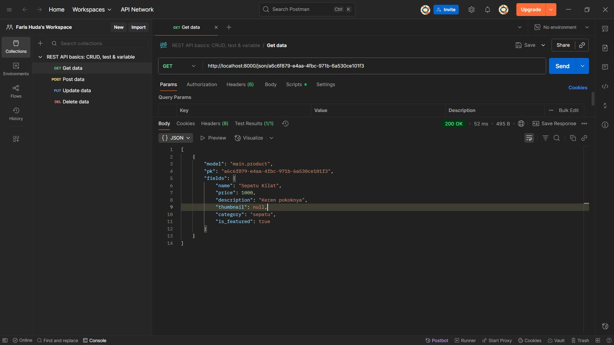

Link PWS: https://faris-huda-inisportstation.pbp.cs.ui.ac.id/

# Tugas 2
1. Implementasi checklist di atas:
    - Membuat direktori/folder "ini_sportstation" yang akan digunakan sebagai direktori utama dari project ini
    - Membuat virtual environment
    - Mengaktifkan virtual environment
    - Membuat list dependencies "requirements.txt" dan install seluruhnya
    - Konfigurasi environment variables dan project pada .env dan .env.prod, production, serta database
    - Load environment variables ke settings.py
    - Menambahkan "127.0.0.1" pada ALLOWED_HOSTS agar project dapat ditampilkan di "127.0.0.1"
    - Membuat template "main" dan menambahkan "main.html"
    - Membuat model "Product" pada "models.py" yang berisi atribut-atribut seperti name, price, description, thumbnail, category, dan is_featured
    - Melakukan migrasi model untuk merefleksikan perubahan terbaru
    - Menambahkan fungsi "show_main" pada "views.py" untuk mengembalikan tampilan sesuai dengan request pada http (viewing)
    - Memodifikasi template "main.html" agar dapat menampilkan "nama_apps", "npm", "name", dan "class" yang ada pada "context" di "views.py"
    - Melakukan routing (pemetaan URL ke view function) pada aplikasi dan project
    - Menambahkan URL pattern pada aplikasi agar saat ada request '', fungsi "show_main" dijalankan
    - Menambahkan URL pattern pada project agar saat ada request '', meneruskan request ke "urls.py" pada aplikasi "main"
    - Melakukan push ke repository

2. Bagan request client ke web aplikasi berbasis Django dan penjelasannya
    - Link bagan: https://drive.google.com/file/d/1a__FguWDzarlRScibpGpqhc6WgUsGZR_/view?usp=sharing
    - Penjelasan:
        - User atau browser mengirimkan suatu HTTP request yang akan diterima oleh "urls.py" pada project
        - Jika request mengikuti suatu pola tertentu, maka request akan diteruskan "urls.py" pada aplikasi yang bersesuaian
        - Request kemudian diterukan ke "views.py" pada aplikasi tersebut
        - "views.py" membaca data dari "models.py" yang akan digunakan untuk menampilkan tampilan
        - "views.py" juga dapat menulis data ke "models.py"
        - "views.py" juga mengambil template dari direktori template yang berisi file-file HTML sesuai dengan fungsi yang dijalankan
        - Setelah melakukan proses-proses tersebut, "views.py" akan menampilkan respon HTTP (dalam bentuk HTML). Misal seperti menampilkan menu, kredensial, dan lain sebagainya.

3. Peran "settings.py" dalam proyek Django
    - Secara garis besar, "settings.py" berperan sebagai file konfigurasi utama untuk proyek Django tersebut. Di dalamnya berisi setting-setting penting yang diperlukan Django agar dapat menjalankan aplikasi-aplikasi yang ada pada proyek.
    - Konfigurasi yang ada antara lain adalah:
        - Security (SECRET_KEY, ALLOWED_HOSTS)
        - Debugging (DEBUG)
        - Installed Apps (INSTALLED_APPS)
        - Middleware (MIDDLEWARE)
        - Konfigurasi Database (DATABASES)
        - Template (TEMPLATES)
        - Static Files (STATIC_URL, STATICFILES_DIRS, STATIC_ROOT)
        - Media Files (MEDIA_URL, MEDIA_ROOT)
        - Internationalization (LANGUAGE_CODE, TIME_ZONE, USE_I18N, USE_TZ)
        - Email settings (EMAIL_BACKEND, EMAIL_HOST, EMAIL_PORT, EMAIL_HOST_USER, EMAIL_HOST_PASSWORD)
        - Authentication (AUTH_USER_MODEL, LOGIN_URL, LOGIN_REDIRECT_URL)
        - Security settings untuk Cookies (CSRF_COOKIE_SECURE, SESSION_COOKIE_SECURE)
        - Security settings untuk Production (SECURE_HSTS_SECONDS, SECURE_SSL_REDIRECT)
        - Logging (LOGGING)
        - Third Party dan Custom App Settings

4. Cara kerja migrasi database di Django
    - Programmer membuat suatu perubahan pada class yang ada di "models.py"
    - Programmer perlu membuat file migrasi dengan "python manage.py makemigrations"
    - Django akan membaca perubahan yang terjadi pada "models.py" dan membuat file migrasi di folder "migrations"
    - File migrasi berisi Python Instructions tentang bagaimana database harus diubah
    - Programmer kemudian menerapkan migrasi ke database dengan "python manage.py migrate"
    - Django akan menjalankan perintah SQL sesuai pada file migrasi yang ada di folder "migrations" serta menyimpannya di tabel khusus "django_migrations" yang akan mencatat migrasi mana saja yang sudah dijalankan
    - Database telah diperbaharui dan sesuai dengan model terbaru

5. Alasan framework Django dijadikan permulaan pembelajaran pengembangan perangkat lunak (atau cocok untuk pemula)
    - Django sudah lengkap secara bawaan dengan menyediakan ORM (untuk database), autentikasi user, sistem template, dan lainnya. Programmer pemula tidak perlu menambahkan banyak library eksternal.
    - Django mengajarkan pola dasar software engineering dengan pola MVT sehingga membantu pemula memisahkan logika bisnis, data, dan presentasi
    - Dokumentasi banyak dan komunitas yang besar
    - Mudah digunakan karena menggunakan bahasa Python
    - Mengajarkan konsep penting seperti relasi database (one-to-many, many-to-many), manajemen migrasi database, routing, keamanan, dan lainnya
    - Hasil dapat dilihat dengan cepat
    - Cocok sebagai prototype (digunakan untuk latihan belajar) dan production (digunakan untuk produksi yang sudah dapat diakses oleh orang luas)

6. Feedback untuk asisten dosen di Tutorial 1
    - Tutorial 1 sudah jelas dan asisten dosen sudah responsif jika ada isu yang bermunculan. Terima kasih banyak kakak asdos sekalian dan tetap semangat.

# Tugas 3
1. Jelaskan mengapa kita memerlukan data delivery dalam pengimplementasian sebuah platform?
    - Memastikan data sampai ke pihak yang tepat (siapa yang berhak, kapan harus dikirim, dalam format apa, dan sebagainya).
    - Menjamin integritas dan keandalan (data tidak hilang di tengah jalan, tidak korup saat berpindah, bisa di-retry jika ada kegagalan jaringan). Misalnya menggunakan HTTP/HTTPS.
    - Mempercepat kinerjan dan efisiensi. Misalkan dengan melakukan caching supaya data yang sering diminta tidak perlu diambil ulang, melakukan chunking agar file besar tidak menahan seluruh sistem, dan mengoptimalkan bandwidth.
    - Membuat pengiriman data lebih aman. Misalkan dengan mengenkripsi data selama transit (TLS) dan memverifikasi identitas pengirim.
    - Memudahakan skalabilitas dan integrasi. Platform lebih mudah untuk berintegrasi dengan microservices lain, third party API, perangkat IoT, dan lainnya.

2. Menurutmu, mana yang lebih baik antara XML dan JSON? Mengapa JSON lebih populer dibandingkan XML?
    - Menurut saya pribadi, lebih baik JSON karena secara sintaks lebih enak dilihat dibanding XML.
    - Alasan JSON lebih populer dibanding XML:
        - Sintaks JSON lebih sederhana dan ringkas. JSON hanya memakai tanda "{}", "[]", ":", dan ",", sedangkan XML memiliki banyak tag pembuka dan penutup. Akibatnya, ukuran dokumen XML lebih besar dibanding JSON.
        - JSON memiliki dukungan bawaaan di JS dan bahasa modern. Oleh karena JSON berasal dari JS, JSON dapat dipakai langsung tanpa library tambahan. Selain itu, hampir semua bahasa populer seperti Python, Java, PHP, Go, dan lainnya memiliki parser JSON yang ringan dan cepat, sedangkan XML butuh parser yang lebih kompleks.
        - Ukuran data JSON lebih kecil akibat sintaks yang lebih sederhana dan ringkas.
        - Proses serialisasi dan deserialisasi lebih cepat karena secara alami struktur JSON cocok dengan object atau dictionary, tidak seperti XML yang seperti tree.
        - Lebih cocok untuk API modern.
        - Mudah saat debugging karena lebih enak dilihat di editor atau browser.

3. Jelaskan fungsi dari method is_valid() pada form Django dan mengapa kita membutuhkan method tersebut?
    - Fungsi is_valid() pada form Django:
        - Menjalankan proses validasi yang mengecek apakah setiap field yang wajib diisi sudah terisi, tipe data tiap field sesuai, dan menjalankan validator tambahan sesuai yang didefinisikan pada model.
        - Mengisi atribut cleaned_data pada dictionary form.cleaned_data jika validasi sukses. cleaned_data berisi data yang sudah siap dipakai karena sudah dikonversi ke tipe Python yang tepat.
        - Mendeteksi kesalahan (error) jika ada field yang tidak valid dan menyimpannya di form.errors dan dapat ditampilkan ke pengguna.
    - Mengapa method tersebut dibutuhkan?
        - Tanpa is_valid(), kita tidak tahu apakah data yang dikirim user lengkap, sesuai tipe, dan lolos aturan (validator).
        - Misalkan kita memanggil form.save() tanpa is_valid(), data yang disimpan bisa berupa data yang kosong atau data yang salah. Akibatnya, dapat terjadi error runtime dan membuka celah keamanan seperti injeksi data.

4. Mengapa kita membutuhkan csrf_token saat membuat form di Django? Apa yang dapat terjadi jika kita tidak menambahkan csrf_token pada form Django? Bagaimana hal tersebut dapat dimanfaatkan oleh penyerang?
    - Alasan dibutuhkannya csrf_token saat membuat form di Django:
        CSRF adalah serangan di mana penyerang memanfaatkan sesi login korban untuk mengirimkan request berbahaya. Dengan csrf_token, setiap request POST benar-benar berasal dari halaman server, bukan situs selainnya. Jika token tidak sesuai, Django akan mengembalikan 403 Forbidden dan menolak request.
    - Apa yang terjadi jika csrf_token tidak ditambahkan?
        - Jika middleware CSRF diaktifkan, Django akan menolak request POST tanpa token dan user akan mendapatkan error "CSRF verification failed".
        - Jika middleware CSRF dimatikan (atau dengan bypass), form menjadi rawan diserang.
    - Bagaimana penyerang memanfaatkan tidak ditambahkannya csrf_token pada form?
        - Misalkan ada suatu form tanpa CSRF protection.
        - Penyerang dapat membuat site berisi script yang akan mengirimkan suatu nilai ke form tersebut (submit).
        - Korban yang sedang login ke site kita juga membuka halaman penyerang.
        - Browser otomatis mengirim cookie session korban ke server kita bersama form yang dikirim oleh penyerang.
        - Karena tidak ada token unik, server memproses kedua form tersebut karena form tersebut dianggap sah.

5. Jelaskan bagaimana cara kamu mengimplementasikan checklist di atas secara step-by-step (bukan hanya sekadar mengikuti tutorial).
    - Saya membuat direktori templates pada root folder dan membuat base.html. base.html akan berfungsi sebagai kePOrangka umum untuk halaman web lain dalam proyek saya. Saya juga menambahkannya ke TEMPLATES pada settings.py.
    - Saya mengubah main.html pada main/templates/ agar menggunakan template base.html dengan meng-extend base.html ke main.html menggunakan .
    - Saya membuat forms.py yang akan digunakan sebagai form. Di sana saya membuat class ProductForm yang berisi class Meta yang berisi model berupa Product dan fields sesuai dengan atribut Product.
    - Pada views.py, saya membuat fungsi create_product() dan show_product() dan menambahkan path-nya pada urls.py. Saya juga mengupdate blok content pada main.html di main/templates/ agar dapat menampilkan data product dan button "Add Product".
    - Pada main/templates/, saya menambahkan 2 file baru yaitu create_product.html untuk membuat produk baru dan product_details.html untuk menampilkan detail dari masing-masing produk. Saya juga menambahkan URL deployment PWS pada CSRF_TRUSTED_ORIGINS.
    -  Pada views.py, saya membuat 4 fungsi yaitu show_xml() yang mengembalikan seluruh data dalam bentuk XML, show_json() yang mengembalikan seluruh data dalam bentuk JSON, show_xml_by_id() yang mengembalikan data sesuai ID dalam bentuk XML, dan show_json_by_id() yang mengembalikan data sesuai ID dalam bentuk JSON.
    - Setelah 4 fungsi tersebut dibuat, saya menambahkan path dari masing-masing fungsi tersebut pada urls.py

6. Apakah ada feedback untuk asdos di tutorial 2 yang sudah kalian kerjakan?
    Asdos cepat menanggapi dan sangat membantu saya waktu debugging. Terima kasih banyak kak.

7. Mengakses keempat URL di poin 2 menggunakan Postman, membuat screenshot dari hasil akses URL pada Postman, dan menambahkannya ke dalam README.md.

    - Screenshot POSTMAN untuk fungsi show_xml()
    

    - Screenshot POSTMAN untuk fungsi show_json()
    

    - Screenshot POSTMAN untuk fungsi show_xml_by_id()
    

    - Screenshot POSTMAN untuk fungsi show_json_by_id()
    

# Tugas 4
## Apa itu Django AuthenticationForm? Jelaskan juga kelebihan dan kekurangannya.
`AuthenticationForm` adalah salah satu form bawaan Django yang digunakan untuk autentikasi user (seperti login). `AuthenticationForm` berada pada modul `django.contrib.auth.forms`.

`AuthenticationForm` menyediakan field username dan passowrd, memvalidasi apakah username-password cocok dengan data user di databases,serta mengecek apakah user masih aktif denga `is_active=True`.

- Kelebihan:
    - Merupakan built-in (siap pakai) sehingga tidak perlu menulis validasi login manual lagi.
    - Terintegrasi dengan sistem auth Django
    - Keamanan terjamin dengan adanya validasi password yang aman, menolak login user yang tidak aktif, dan menggunakan hashing password bawaan Django.
    - Mudah dikustomisasi (field dapat ditambahkan dengan mudah).

- Kekurangan:
    - Terbatas pada field default karena secara default `AuthenticationForm` hanya menyediakan usernam dan password sebagai bentuk login/. Jika sistem login yang diinginkan menggunakan cara login lain seperti email atau nomor telepon, diperlukan override.
    - Tampilan sederhana (tidak ada styling bawaan)
    - Kurang fleksibel untuk kasus kompleks seperti login multi-factor (misal OTP, SMS, dan lainnya) yang diharuskan untuk menggunakan form khusus atau extend dari `AuthenticationForm`
    - Validasi error generik, perlu override untuk UX yang lebih baik.

## Apa perbedaan antara autentikasi dan otorisasi? Bagaiamana Django mengimplementasikan kedua konsep tersebut?
Autentikasi adalah proses memverifikasi identitas user. Contohnya adalah login dengan username dan password, OTP via SMS, dan lainnya. Autentikasi seperti menjawab pertanyaan "Siapa kamu? (Identitas)"

Otorisasi ada proses menentukan hak akses user setelah dia berhasil login (autentikasi). Contohnya adalah user tidak bisa melihat dashboard user lain, admin dapat melihat dashboard seluruh user, dan sebagainya. Otorisasi seperti menjawab pertanyaan "Hal apa saja yang boleh kamu lakukan? (Hak akses)"

Implementasi keduanya pada Django adalah sebagai berikut:
- Autentikasi:
    - User model: Django menyediakan `User` di `django.contrib.auth.models`
    - `AuthenticationForm` untuk validasi username dan password
    - Backend autentikasi: Merupakan kelas yang mengurus cara Django memeriksa kredensial (defaultnya adalah `ModelBackend`)
    - Session: Setelah login sukses, Django menyimpan ID user di sesion sehingga request berikutnya bisa dikenali.

- Otorisasi:
    - Permissions (izin) per model: Secara otomatis, Django menyediakan izin dasar seperti `add`, `change`, `delete`, dan `view`.
    - Groups: Sekumpulan izin yang diberikan ke banyak user sekaligus
    - Decorators dan Mixin:
        - `@login_required`: Hanya user yang login yang bisa akses
        - `@permission_required`: Hanya user dengan izin tertentu yang bisa akses
        - `UserPassesTestMixin`, `PermissionRequiredMixin`: Untuk class-based views

## Apa saja kelebihan dan kekurangan session dan cookies dalam konteks menyimpan state di aplikasi web?
Cookies adalah penyimpanan data kecil di browser yang otomatis dikirim ke server setiap melakukan request pada domain yang sama.
- Kelebihan:
    - Disimpan di client-side sehingga tidak membebani server
    - Persisten (dapat bertahan setelah browser ditutup)
    - Mudah digunakan
    - Semua browser mendukung cookies
    - Dapat diakses client melalui JavaScript
- Kekurangan:
    - Ukuran terbatas maksimal 4KB per cookie
    - Kurang aman (rentan terhadap serangan)
    - Memperbesar request akibat otomatis terkirim ke server
    - Tidak cocok untuk data sensitif
    - Mudah dimanipulasi

Session adalah penyimpanan data user di server yang disimpan di database, cache, atau file. Browser hanya menyimpan session ID (yang biasanya disimpan di cookie).
- Kelebihan:
    - Lebih aman karena data disimpan di server
    - Ukuran data lebih besar dibanding cookies
    - Dapat diatur kadaluwarsa (expiry date)
    - Sulit dimanipulasi
    - Fleksibel (lintas halaman)
- Kekurangan:
    - Membebani server karena semua session data disimpan di server
    - Perlu manajemen tambahan seperti membersihkan session yang kadaluwarsa
    - Butuh cookie atau mekanisme lain untuk menyimpan session ID di client
    - Tidak persisten secara default (hilang jika browser ditutup)
    - Perlu mekanisme session sharing untuk aplikasi multi-server

## Apakah penggunaan cookies aman secara default dalam pengembangan web, atau apakah ada risiko potensial yang harus diwaspadai? Bagaimana Django menangani hal tersebut?
Secara default, cookies tidak sepenuhnya aman. Cookies adalah penyimpanan kecil di sisi client (browser) yang dikirim balik ke server setiap kali client melakukan request. Risiko potensial yang dapat terjadi antara lain:

- Pencurian cookies (Session Hijacking): Cookie yang tidak dienkripsi atau diproteksi dapat dicuri oleh penyerang. Akibatnya, penyerang dapat berpura-pura login seperti korban.
- Cross-Site Scripting (XSS): Jika ada celah XSS, penyerang dapat menjalankan sebuah script JavaScript di browser korban dan membaca cookie milik korban.
- Cross-Site Request Forgery (CSRF): Penyerang dapat memanfaatkan pengiriman cookie otomatis di setiap request untuk mengirimkan request berbahaya
- Insecure Transmission (tanpa HTTPS): Cookie yang dikirim lewat HTTP biasa (tanpa HTTPS) bisa disadap oleh penyerang (seperti man-in-the-middle).

Cara Django menangani hal tersebut:

- Session berbasis cookie: Django menggunakan session framework dimana session ID disimpan di cookie, tetapi data user di server. Sehingga meski cookie dicuri oleh penyerang, yang bocor hanyalah session IDnya.
- Cookie Flags: Django dapat mengatur opsi keamanan cookie di `settings.py`. Opsi keamanan yang ada antara lain:
    - `SESSION_COOKIE_SECURE = True`: Cookie hanya dikirim lewat HTTPS
    - `SESSION_COOKIE_HTTPONLY = True`: Cookie tidak bisa diakses oleh JavaScript
    - `SESSION_COOKIE_SAMESITE = Lax` (atau `Strict`): Membatasi cookie dikirim dari domain lain
    - `CSRF_COOKIE_SECURE`, `CSRF_COOKIE_HTTPONLY`, dan `CSRF_COOKIE_SAMESITE`: Aturan yang sama namun untuk Cookie CSRF.
- CSRF Protection: Django secara otomatis menambahkan token pada form POST dan memverifikasinya di server.
- Session Expiry: Session dapat diatur agar otomatis kadaluwarsa (expired). Misalnya session diatur expired jika browser sudah di-close. Cookie juga dapat diatur hanya berlaku selama berapa hari.

## Jelaskan bagaimana cara kamu mengimplementasikan checklist di atas secara step-by-step (bukan hanya sekadar mengikuti tutorial).
Membuat register, login, dan logout dengan implementasi fungsi `register`, `login_user`, dan `logout_user`:
- Melakukan import berikut pada `views.py`:
    - `from django.contrib.auth.forms import UserCreationForm, AuthenticationForm`
    - `from django.contrib import messages`
    - `from django.contrib.auth import authenticate, login, logout`
- Menambahkan fungsi `register` untuk melakukan register, `login_user` untuk melakukan login user, dan `logout_user` untuk melakukan logout user di `views.py`
- Membuat file `register.html` untuk tampilan saat register dan `login.html` untuk tampilan saat login dan menambahkannya ke `main/templates`.
- Menambahkan `button` logout pada `main.html` di `main/templates`
- Pada `urls.py`, melakukan import fungsi `register`, `login_user`, dan `logout_user` serta menambahkan masing-masing pathnya pada `urlpatterns`

Membatasi akses `main.html` dengan implementasi fungsi `@login_required`:
- Melakukan import `from django.contrib.auth.decorators import login_required` pada `views.py`
- Menambahkan `@login_required(login_url='/login')` pada `show_main` dan `show_product` yang bertujuan untuk menampilkan `main.html` dan `product_details.html` hanya jika sudah login

Menggunakan data dari cookies dengan implementasi timestamp (`datetime`):
- Melakukan import berikut pada `views.py`:
    - `import datetime`
    - `from django.http import HttpResponseRedirect`
    - `from django.urls import reverse`
- Menambahkan `last_login` yang bertujuan mendapatkan cookies `last_login` pada `context` di `show_main`
- Menghapus cookie `last_login` setelah logout dengan mengubah fungsi `logout_user`
- Menambahkan informasi sesi terakhir login pada `main.html` di `main/templates`

Menghubungan model `Product` dengan `User`:
- Melakukan import `from django.contrib.auth.models import User` pada `models.py`
- Menghubungkan suatu product ke suatu user dengan `user = models.ForeignKey(User, on_delete=models.CASCADE, null=True)`. Hubungan yang dihasilkan adalah many-to-one karena beberapa product dapat dijual oleh satu user.
- Melakukan migrasi
- Menambahkan decorator `@login_required` pada `create_product` dan melakukan beberapa perubahan agar product yang dibuat dapat berasosiasi dengan user
- Memodifikasi fungsi show main dengan menambahkan `filter_type` yang bertujuan untuk melakukan filtering konten yang ditampilkan di `main.html`. Filtering ini bertujuan agar hanya menampilkan konten sesuai dengan filter yang ada (yakni "all" dan "my" yang berarti seluruh produk dan produk sendiri).
- Memodifikasi `name` pada `context` agar sesuai dengan username dari user pada request.
- Menambahkan button dengan filter "my" dan "all" pada `main.html`
- Memodifikasi `news_detail.html` agar menampilkan nama penjual